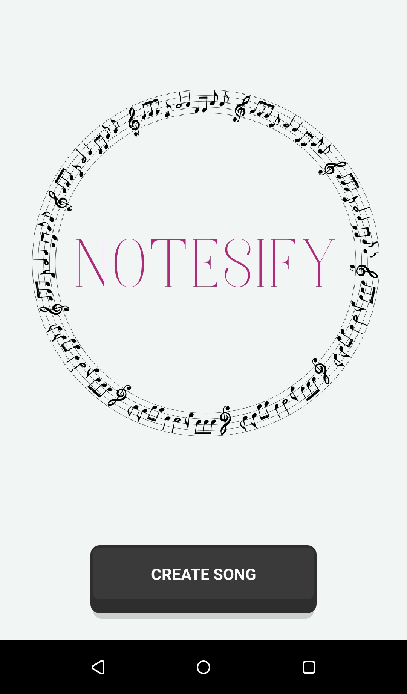
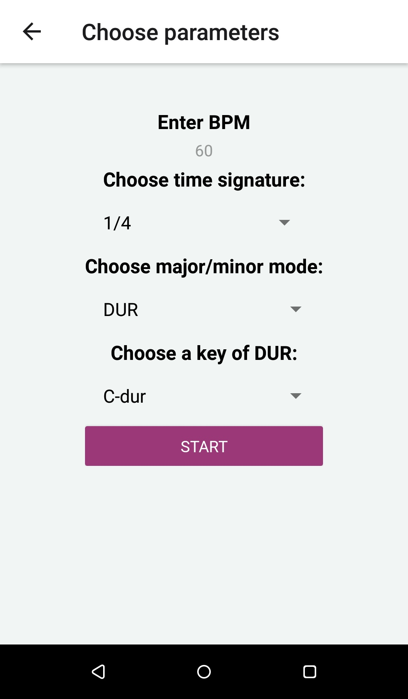

# Notesify

Mobile application for writing MIDI signal in musical notation, dedicated to Android users.
This application is used to write notes in real time.
For this purpose, a MIDI controller was used, the protocol of which transfers sets of commands via the USB port connected to the phone.
This way, the user playing the control keyboard, notices the appearing notes on the music staff.
The project contains the implementation of a multifunctional algorithm that allows to read and write a signal in the form of notes.
The application was programmed in React Native, using JavaScript.

## Screenshots

The first view is the startup window containing the application's logo and a button to start creating a song.

The user selects the parameters for shaping the musical staff. From the presented view, it is possible to choose the tempo - bpm, time signature, mode: major or minor and the key.

The tempo selection option is determined by the numeric keyboard.

The user chooses time signature, these are the most commonly used measures.

Choice between mode and their corresponding keys

Notation of the user's full playing, with the four by four meter selected, the key of C major, and a double bar line at the end of the song (added by clicking the “end song” button).

The purpose of the application is to improve the work of the begginer, musician or composer, who often need to use programs designed to create musical notation. The application is easy to use and open for extension to other platforms like iOS.

## License

[MIT](https://choosealicense.com/licenses/mit/)
